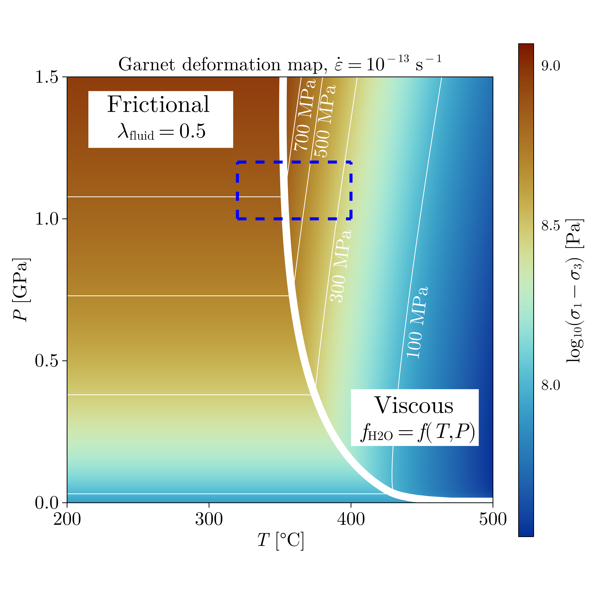
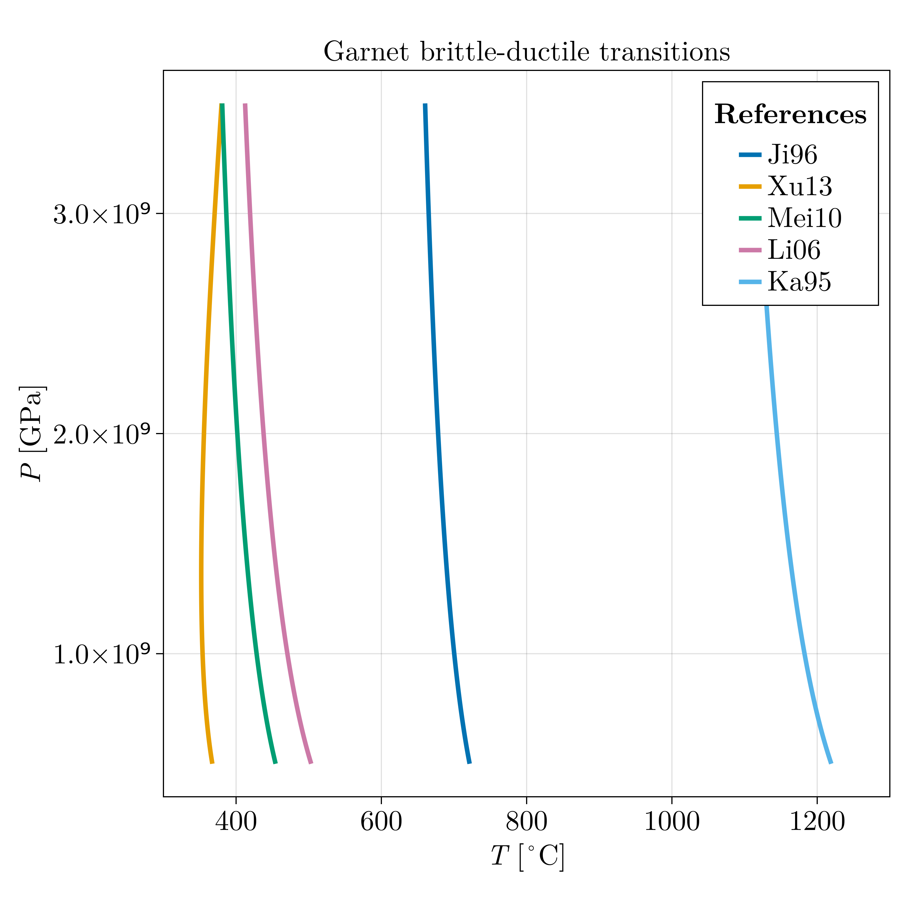

# GarnetFlowLaws

Garnet deformation map used in the publication of [Zulauf et al. (2023)](https://www.sciencedirect.com/science/article/abs/pii/S019181412300202X).

Garnet brittle-ductile transitions predicted using a Drucker-Prager model and various experimental creep data. 

